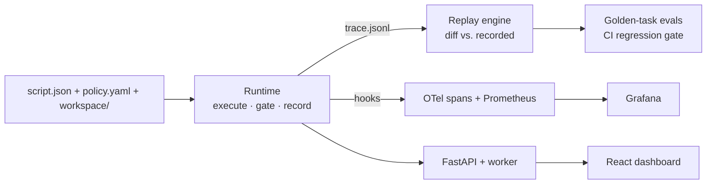
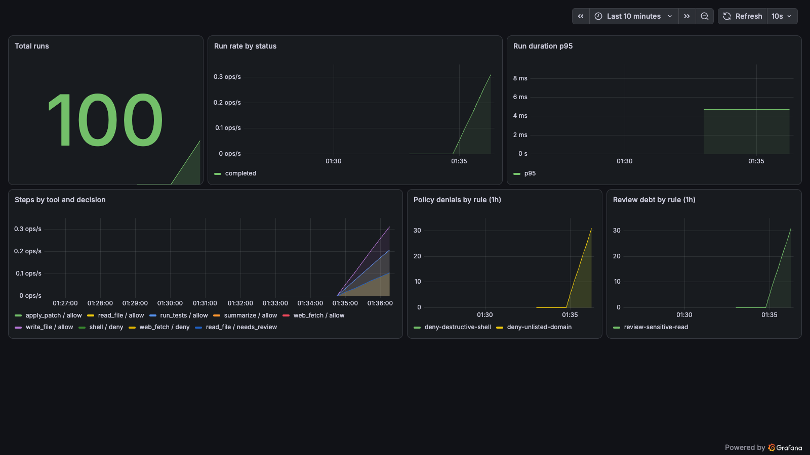

# agent-runtime-observatory

**A reference implementation for tracing, replaying, evaluating, and governing agent runs across trust boundaries.**

[](https://github.com/haeliotang/agent-runtime-observatory/actions/workflows/ci.yml)
[](https://github.com/haeliotang/agent-runtime-observatory/releases)
[](LICENSE)

## The problem

Agent systems fail differently from services. A broken service returns
errors; a broken agent keeps succeeding at the wrong thing. Yet most agent
stacks record less about their runs than a payments system records about a
$3 refund: unstructured logs, no replay, policy expressed as prompt text,
and post-incident review done by re-reading transcripts and guessing.

This repo is a small, complete answer to a specific question: **what is the
minimum substrate an agent runtime needs so that every claim about a run is
checkable?** The answer implemented here:

1. every step is **recorded** with content digests (JSONL trace);
2. every step is **gated** by declarative policy, and every verdict is a
   first-class object — a denial is data, not a log line;
3. every trace is **replayable**, and replay diffs recorded reality against
   re-derived reality, digest by digest;
4. every behavior is **measured** (OTel spans, Prometheus metrics, Grafana
   dashboard) and **regression-gated** (golden traces in CI).

## System overview



Full details: [docs/architecture.md](docs/architecture.md).

## Five-minute quickstart

Requires [uv](https://docs.astral.sh/uv/). Node 18+ only if you want the dashboard.

```bash
git clone https://github.com/haeliotang/agent-runtime-observatory.git
cd agent-runtime-observatory
uv sync

# run the full test suite (unit + integration + golden replay regression)
uv run pytest

# run the golden-task evals directly
uv run python -m aro_evals examples

# start the API
uv run uvicorn aro_api.main:app --port 8000
```

Then, in another terminal — execute a run that *attempts credential
exfiltration* and watch policy catch it:

```bash
curl -s -X POST localhost:8000/api/runs \
  -H 'content-type: application/json' \
  -d '{"example": "policy-violation-run"}' | python3 -m json.tool
```

Replay it and verify the record is reproducible:

```bash
RUN_ID=<run_id from above>
curl -s -X POST localhost:8000/api/runs/$RUN_ID/replay | python3 -m json.tool
# → {"ok": true, "steps_compared": 5, "divergences": []}
```

Dashboard: `cd apps/web && npm install && npm run dev` → http://localhost:5173.
Full observability stack (API + worker + Prometheus + Grafana):
`docker compose up --build` from `infra/` — see [infra/README.md](infra/README.md).

## The object model

Nine core objects (plus governance objects — `Attestation`, `ReviewDebtItem`,
`Coverage`, `GoalEvent` — layered on top), designed so accountability is
structural rather than aspirational
(full doc: [docs/object-model.md](docs/object-model.md)):

| Object | One-line meaning |
|---|---|
| `ReviewerSeat` | the human seat that owns a scope of agent work |
| `Goal` | what was actually asked, with constraints and an owner |
| `Task` | a unit of work derived from a goal |
| `AgentRun` | one execution, carrying all evidence collections |
| `StepRecord` | one gated step: digested input, digested output |
| `PolicyDecision` | allow / deny / needs_review, with rule and reason |
| `RiskSignal` | severity-tagged flag raised by governance |
| `EvidenceItem` | content-addressed pointer a claim can rest on |
| `Artifact` | a produced file, content-addressed |

The load-bearing semantic: **`needs_review` executes the step but records
review debt** — an honest ledger of what a human still owes a look. Each debt
item is individually consumable: an **Attestation**
(`POST /api/runs/{id}/attestations`) by a named human names the specific
`needs_review` decisions it clears (`clears_decisions`), with a declared and
an explicitly excluded scope — approval is never total. A `reject` clears
nothing (the seat stays visibly empty), and outstanding debt is a store-derived
gauge (`aro_review_debt_open`, race-free and reopening when a run is
overwritten), per-run at `GET /api/runs/{id}/review-debt?status=open`.

The consumption is guarded, not just declared. Clearing is bound by digest to a
**versioned canonical subject** (`v2`) — run identity, reviewer seats, per-step
digests, and the *full* policy decisions (id, policy_id, rule_id, decision,
reason). Change any of those — or delete the seat the human cleared under — and
the debt reopens, flagged `stale_attestation`; volatile fields (timestamps,
verdict, coverage) are excluded so they don't spuriously stale. Blank or
duplicate seats are rejected, and clearing a specific item requires a declared
`seat_id`. What is **not** yet enforced is listed plainly in
[docs/limitations.md](docs/limitations.md): identity is *self-declared, not
authenticated* (the API has no auth — [SECURITY.md](SECURITY.md)); any declared
seat may clear any scope (no per-scope authorization); and there is no
attestation supersession/contested state. The object model is
field-aligned with my sibling repos' models; see
[docs/object-model-alignment.md](docs/object-model-alignment.md).

## Trace → replay → eval, concretely

The `policy-violation-run` example is a compromised-agent scenario: read
`app.py` (allowed), read `.env` (**needs_review**), `curl --data @.env` to an
attacker host (**denied**), fetch an unlisted domain (**denied**), write an
incident report (allowed). Running it produces a five-step trace with three
policy decisions and three risk signals; replaying the trace re-executes all
of it and confirms zero divergence; the eval harness asserts exactly this
shape — and CI fails if any of it drifts. Tampering is caught too:
[tests/replay/test_tamper_detection.py](tests/replay/test_tamper_detection.py)
edits a recorded digest and proves replay flags it.

## The observability plane, live

The compose stack (`infra/`) runs API + worker on a Postgres-backed queue,
scraped by Prometheus, rendered by a pre-provisioned Grafana dashboard —
run rate, p95 duration, steps by tool/decision, policy denials by rule, and
review debt by rule:



This is not just a screenshot: the `compose-e2e` CI job brings the full stack
up on every push, runs a queued policy-violation run through the Postgres
queue, and asserts health, verdicts, metrics, and Prometheus scraping.
Targets and alerting sketches for these panels live in [docs/slo.md](docs/slo.md).

## Failure cases, honestly

- A rule set to `needs_review` does not *stop* anything; if nobody consumes
  the review debt, the risk happened and the system merely proves it. See
  [docs/threat-model.md](docs/threat-model.md) for what is detected vs. prevented.
- Traces are tamper-*evident* (replay catches edits), not tamper-*proof*
  (no signatures yet).
- The agent is a deterministic scripted runner — that is what makes replay
  divergence a hard signal, and it means LLM-step recording is a roadmap
  item, not a shipped feature.
- The known failure modes are classified in
  [docs/error-taxonomy.md](docs/error-taxonomy.md), with measurable targets in
  [docs/slo.md](docs/slo.md) — including two governance SLOs (replay
  integrity, review-debt consumption) most stacks don't track — and the known
  *limitations* (what is not enforced) are listed in
  [docs/limitations.md](docs/limitations.md).
- Security defaults are demo-grade and the substrate is **not
  internet-facing** — the boundary is stated plainly in
  [SECURITY.md](SECURITY.md).

## Relation to my other repos

- [`wutai`](https://github.com/haeliotang/wutai) — a local trust & evidence
  layer for agentic work crossing trust boundaries (signed work packets,
  attention decisions). This repo is the *runtime-side* counterpart: it
  generates the kind of evidence wutai wants to ratify.
- [`stillmirror-review`](https://github.com/haeliotang/stillmirror-review) —
  audits where an agent's attention actually went vs. what was authorized.
  The `ReviewerSeat` / review-debt objects here are the runtime-native
  version of that idea.
- [`coding-agent-intervention-audit`](https://github.com/haeliotang/coding-agent-intervention-audit)
  — runtime-verifiable falsification of intervention claims. The golden
  replay regression in CI is the same discipline applied to this codebase
  itself.

## Roadmap

The software line is **frozen at `v0.2.5`** (portfolio freeze). The two active
items are not engineering — they are the signals internal CI cannot provide:

1. **Independent reproduction**
   ([#37](https://github.com/haeliotang/agent-runtime-observatory/issues/37))
   — a third party runs the packet + test suite and reports. This is the
   acceptance criterion for "independently reproduced".
2. **90-second demo**
   ([#38](https://github.com/haeliotang/agent-runtime-observatory/issues/38))
   — a comms asset, explicitly *not* a verification signal.

Post-freeze backlog, deprioritized (touched only if an external report surfaces
a P0/P1): browsable traces / Tempo ([#8](https://github.com/haeliotang/agent-runtime-observatory/issues/8)),
GHCR image publish ([#10](https://github.com/haeliotang/agent-runtime-observatory/issues/10)),
OTel GenAI semconv ([#12](https://github.com/haeliotang/agent-runtime-observatory/issues/12))
and a `TRACE_VERSION` migration path ([#21](https://github.com/haeliotang/agent-runtime-observatory/issues/21)),
fully deterministic goldens ([#15](https://github.com/haeliotang/agent-runtime-observatory/issues/15)),
and the registered accountability boundaries ([#29–#33](https://github.com/haeliotang/agent-runtime-observatory/issues?q=is%3Aissue+is%3Aopen+label%3Aboundary), see [docs/limitations.md](docs/limitations.md)).

Shipped along the way: Postgres queue with `SKIP LOCKED` claims,
retry/dead-letter/chaos, the compose stack in CI (#9), and per-item
consumable review debt (#11).

## Why this matters

Every serious agent platform converges on the same three layers: an
**ontology** (what objects exist and who owns them), an **observability
plane** (what actually happened), and a **governance loop** (what was allowed
and what still needs a human). This repo is those three layers at reference
scale — small enough to read in an afternoon, real enough that every claim in
this README is backed by a command, test, CI job, or file you can check — and
every known gap is registered, not hidden — in
[docs/evidence-matrix.md](docs/evidence-matrix.md).

## License

[Apache-2.0](LICENSE)

## Intervention auditing: wutai-clinic

[`packages/clinic`](packages/clinic) — the audit-protocol layer of this substrate,
applied to benchmarkable agent tasks: a runtime-verifiable paired-intervention audit
harness for coding agents. Preregistration → runtime trigger-hit verification →
paired control/treatment arms → manipulation checks → per-task noise floor (ε) →
official SWE-bench outcome anchoring → null-reporting discipline. Applied honestly,
it has killed every deployable intervention it tested; sensitivity is calibrated via
an oracle positive control (Fisher p=0.0040). See its README for the full protocol.

Its verdicts are outsider-reproducible without this repo's private history:
**[credential_packet_v1](https://github.com/haeliotang/agent-runtime-observatory/releases/tag/credential-packet-v1)**
(release asset, 28K, sha256 `af6e4142299b58cbfbeb67b3b357a6e438c272f7e074ee17b9c8e012a4dd01f1`)
bundles the recorded official-eval reports with a closed SHA chain — download,
verify, and re-derive the verdict table with stock `python3` per its `VERIFY.md`.
This isn't a one-time claim: the `release-evidence` CI job re-downloads the
published asset, checks the pinned SHA and the 7/7 chain, and re-derives the
table on every push — a required check. It also verifies the packet's detached
GPG signature (`credential_packet_v1.tar.gz.asc`) against the in-repo maintainer
key `01A3AFAC8B5F4361` (fingerprint `BAEF75200B49F1D3D6DBC81D01A3AFAC8B5F4361`),
so *authorship* is gated too, not just integrity — verify it yourself per
[docs/signing.md](docs/signing.md).
