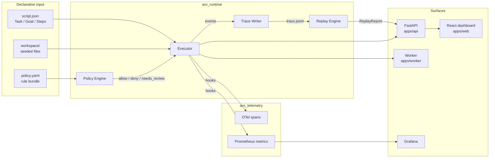

# Architecture

## The system in one diagram

## Components

**`packages/schema`** — the object model (see [object-model.md](object-model.md)).
Pure Pydantic, no runtime dependencies. Everything downstream speaks these
types; everything comparable is compared by sha256 digest.

**`packages/runtime`** — the execution core:

- *Executor* runs a `Script` step by step. Before each tool call it resolves
  `${step:N.output}` references, digests the resolved input, and asks the
  policy engine for a verdict. Denied steps are recorded but not executed;
  the run continues (a working guardrail is not an error). A `ToolError`
  fails the run.
- *Policy engine* evaluates flat declarative rules (tool match, args regex,
  domain allowlist). First match wins; the default applies otherwise.
  `needs_review` executes the step but records a decision and a risk signal —
  review debt instead of silent proceed.
- *Trace writer* appends one JSON event per line. The header embeds the full
  script, the full policy bundle, and the workspace digest, so a trace file is
  self-describing.
- *Replay engine* re-executes the script embedded in a trace against a fresh
  workspace copy and reports every divergence: input/output digests, errors,
  policy decisions, missing/extra steps, workspace drift.
- *Store* is stdlib SQLite: a `runs` table with denormalized summary columns
  and a `queue` table for the worker.

**`packages/telemetry`** — attaches to the runtime through the `RunHooks`
interface, so the runtime has zero telemetry dependencies. One OTel span per
run, one child span per step (with digests and decisions as attributes);
Prometheus counters/histograms per the contract in
[telemetry-model.md](telemetry-model.md).

**`packages/evals`** — the regression gate. For every example: run fresh,
compare against `expected.json`, then replay the committed golden trace and
require zero divergence. `python -m aro_evals` is the CLI; CI runs it via
`tests/replay/`.

**`apps/api`** — FastAPI service exposing runs, traces, replay, and
`/metrics`. Sync mode executes inline; queued mode writes a pending
placeholder and lets the worker pick it up.

**`apps/worker`** — polls the SQLite queue, executes runs with the same hooks,
exposes its own `/metrics` on :9100.

**`apps/web`** — React dashboard over the same `/api/*` routes: runs list,
step timeline with decision badges, risk signals, one-click replay.

## Why a deterministic scripted agent?

Because the interesting claims here are about the *substrate*, not the agent.
A deterministic runner makes "replay divergence" a meaningful signal: if a
replay diverges, the environment changed, the code changed, or the trace was
tampered with — there is no fourth explanation. Plugging an LLM-backed agent
into the same `execute_script` loop (recording instead of re-deriving model
outputs) is the roadmap item that follows from this design, not a rewrite
of it.

## Trust boundary

The runtime treats the workspace as the inside and everything else as the
outside. Tools are simulated: `shell` never reaches a real shell, `web_fetch`
resolves against committed fixtures. Policy is enforced at the boundary
between a scripted intent and a tool execution — the same place a production
agent runtime has to enforce it.
