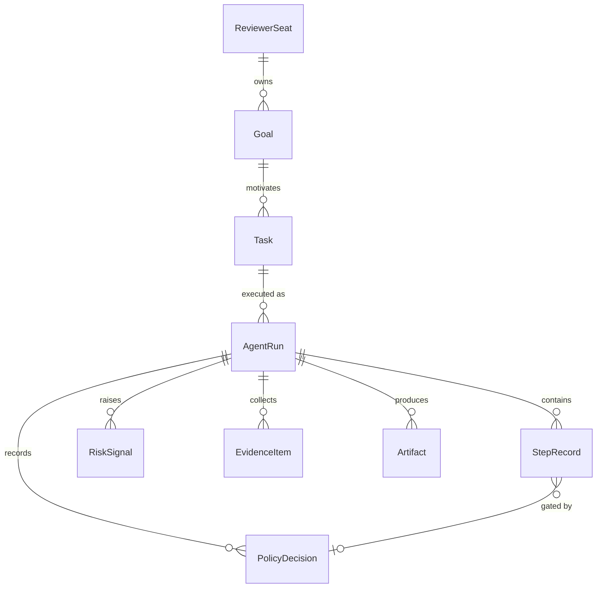

# Object model

The observatory's ontology. Every object is a Pydantic model in
`packages/schema/aro_schema/models.py`, serializable and diffable; identity
is explicit ids, and content is addressed by sha256 digest.

## Accountability objects

**ReviewerSeat** — a named human seat that carries responsibility for a scope
of agent work (`role`: owner, security-reviewer, …; `scope`: what it covers).
Nothing in the system is ownerless: every Goal names its owning seat.

**Goal** — what the human actually asked for: a statement, explicit
constraints, and an `owner_seat_id`. Goals exist so that later review can ask
"did the run serve the goal?" instead of only "did the run finish?".

**Task** — a concrete unit of work derived from a Goal. One Task can be
executed as many AgentRuns.

## Execution objects

**AgentRun** — one execution: which agent, which task, status
(`pending / running / completed / failed`), timestamps, and the four evidence
collections (steps, policy decisions, risk signals, artifacts).

Status semantics worth spelling out:

- a **policy denial does not fail a run** — the blocked step is recorded and
  execution continues. Governance working as designed is a result, not an
  error;
- a **ToolError fails the run** — the agent could not do what the script
  claims it did.

**StepRecord** — one executed (or blocked) step. `input_digest` covers
`(tool, resolved args)`; `output_digest` covers the output text. A blocked
step has no output digest and carries `error` plus a `decision_id` pointing at
the PolicyDecision that blocked it. `output_preview` is for humans; digests
are for verification.

## Governance objects

**PolicyDecision** — the outcome of evaluating one step against the policy
bundle: `policy_id`, `rule_id`, `decision` (`allow / deny / needs_review`),
and a human-readable reason. Decisions are recorded whenever a rule matches;
default-allow (no rule matched) is implicit and not recorded.

`needs_review` is the interesting verdict: the step executes, but the run now
carries recorded review debt — the same decision object and a RiskSignal —
instead of silently proceeding.

**RiskSignal** — a severity-tagged flag (`low → critical`) with a category
(`sensitive-read`, `exfiltration`, …). Emitted for every deny and every
needs_review.

## Evidence objects

**EvidenceItem** — a content-addressed pointer to something a claim rests on
(currently: every tool output). The point of the type is the discipline: a
claim about a run should reference evidence by digest, not by prose.

**Artifact** — a file the run produced, with path, digest, media type, size.

**ReplayReport / StepDivergence** — the output of replaying a trace: how many
steps were compared and every field where the replay disagreed with the record
(`input_digest`, `output_digest`, `error`, `policy_decision`,
`missing_step` / `extra_step`, `workspace_digest`).

## Accountability objects, part two (ported from the siblings)

These objects implement the schema deltas identified in
[object-model-alignment.md](object-model-alignment.md):

**Attestation** — a named human standing behind a scope of a run: the act of
filling a ReviewerSeat. Carries wutai's *scoped ratification* invariant
(`declared_scope` says what IS ratified, `excluded_scope` what explicitly is
NOT) and stillmirror's *draft-is-not-attestation* invariant (`proposed_by`
may be an assistant; only the named human in `attested_by` makes it real).
`subject_digest` pins exactly which stored run record was attested. Recorded
via `POST /api/runs/{id}/attestations`; counted by `aro_attestations_total`.

**AgentRun.verdict** (derived) — wutai-style trust roll-up over the run's
policy decisions: any deny → `blocked`, else any needs_review →
`review_required`, else `trusted`. Serialized into every run JSON.

**Coverage** — the run's own declaration of its observability limits
(`captured` / `blind_spots` / `enforcement`), ported from wutai's
WorkPacketCoverage. The scripted runtime stamps every run and trace header
with an honest one.

**GoalEvent** — one entry in a goal's append-only lifecycle log
(`introduced / reinforced / replaced / retired`), ported from
stillmirror-review's goal-events log. Schema-level in v0.1: the object and
vocabulary exist; automatic lifecycle tracking is roadmap.

**StepRecord.allocated_to / supports_goal** — optional per-step annotations
(rubric labels and a `yes/no/unknown` mainline flag) so a run can express
what each step was *for*, not just what it did.

## Mapping to enterprise platforms

This is deliberately shaped like a miniature ontology layer: stable object
types with explicit ownership, decisions as first-class data, and
content-addressed evidence. The same object shapes generalize beyond the
scripted runtime — an LLM-backed run changes how StepRecords are produced,
not what they are.

## Alignment with sibling repos

For a field-by-field mapping of this object model against the object models of
[`wutai`](https://github.com/haeliotang/wutai) (trust-boundary evidence layer)
and [`stillmirror-review`](https://github.com/haeliotang/stillmirror-review)
(allocation ledger / review debt), including proposed schema deltas that would
make this repo a superset spine for all three, see
[object-model-alignment.md](object-model-alignment.md).
